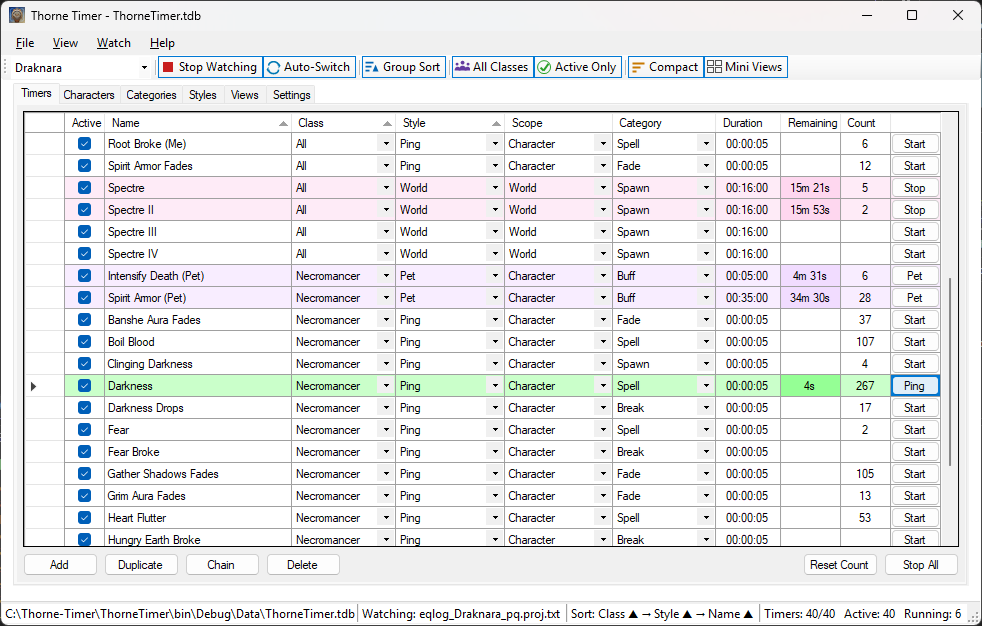
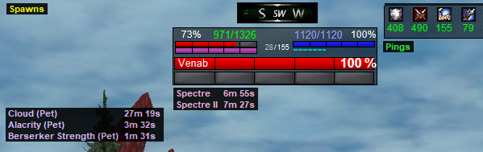
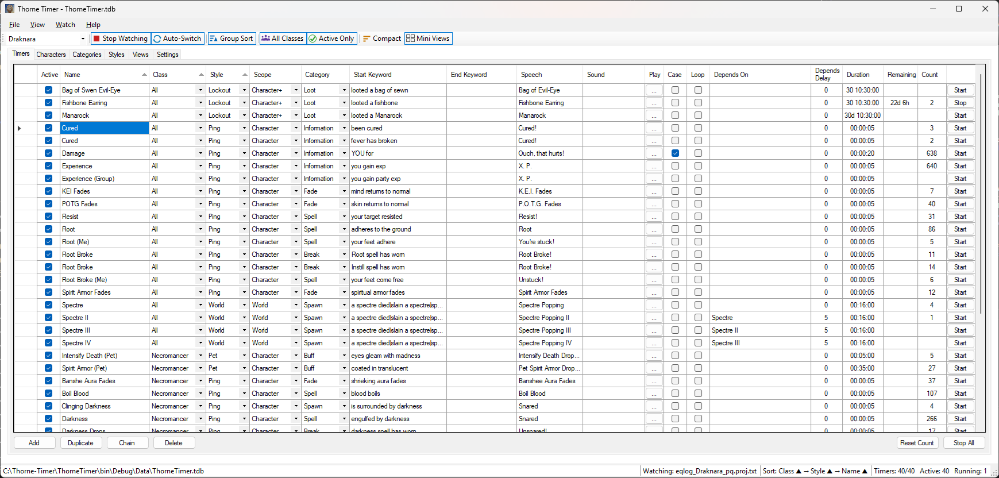
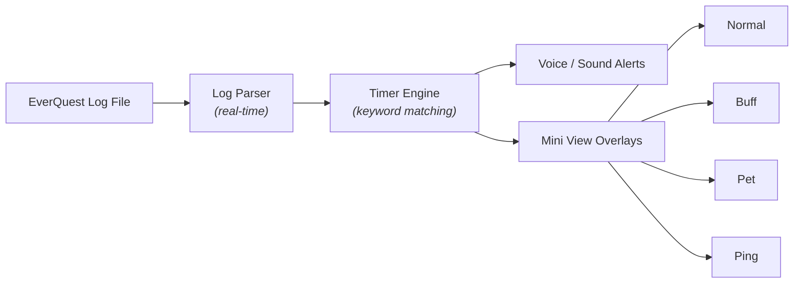

<p align="center">
  
</p>

<h1 align="center">Thorne Timer</h1>

<p align="center">
  <strong>Your EverQuest companion — real-time log parsing, overlay timers, and voice alerts<br/>crafted for the way you play.</strong>
</p>

<p align="center">
  <a href="#features">Features</a> •
  <a href="#screenshots">Screenshots</a> •
  <a href="#getting-started">Getting Started</a> •
  <a href="#how-it-works">How It Works</a> •
  <a href="#working-with-timers">Working with Timers</a> •
  <a href="#faq--troubleshooting">FAQ</a> •
  <a href="#roadmap">Roadmap</a> •
  <a href="#version-history">Versions</a> •
  <a href="#building-from-source">Building</a> •
  <a href="#contributing">Contributing</a>
</p>

---

## About

**Thorne Timer** is a desktop companion built for EverQuest players who want to play smarter. It watches your log files in real-time and turns raw game events into overlay timers, voice alerts, and instant notifications — giving you the situational awareness that UI files alone simply cannot provide.

Whether you're tracking buff durations on a raid, timing respawns while multi-boxing, or catching auction messages across characters, Thorne Timer keeps the information you need visible and organized on screen — always on top, always up to date.

Built and tested with the [Project Quarm](https://www.projectquarm.com/) and [TAKP](https://www.takproject.net/) communities, but the log parsing engine works with **any EverQuest server** (or any application) that writes text-based log files.

### Why Thorne Timer?

EverQuest's native UI files can only go so far. While [**Thorne-UI**](https://github.com/draknarethorne/thorne-ui) transforms your in-game interface with enhanced windows, better layouts, and quality-of-life improvements, there are things you simply *cannot* do with XML UI files alone:

- **Always-visible timers** that persist across zone transitions and game restarts
- **Log-triggered automation** that responds to game events in real-time
- **Voice alerts** and customizable text-to-speech notifications
- **Multi-character tracking** across boxing sessions
- **Separate overlay windows** for different timer types so you see what matters

Thorne Timer fills that gap. It lives *outside* the game, quietly reading your logs and surfacing the information that helps you play better — whether that's knowing exactly when your charm will break, catching a tell while alt-tabbed, or tracking four characters' buff timers at a glance.

> 🎯 Built by a player, for players. This is a community project — feedback, ideas, and contributions are always welcome.

---

## Features

### 🎯 Timer Overlays (Mini Views)
Compact, always-on-top windows that float over your game client. Views are now **fully user-configurable** — add as many as you need, choose which timer style each one shows, and pick its own colors.

Thorne Timer ships with a default set of styles you can edit, rename, or extend:

- **Normal** (yellow) — Standard countdown timers for respawns, cooldowns, and custom events
- **Buff** (orange) — Track buff durations so you never let a key buff drop
- **Pet** (lavender) — Dedicated pet-related timers for summoners and beastlords
- **Ping** (light green) — Instant visual notifications for log events (tells, auction alerts, custom triggers)
- **Spawn** (cyan) — Respawn timers and named-mob windows
- **Lockout** (DodgerBlue) — Long-duration raid and instance lockouts
- **Character** (white) — Per-character overlays such as the active character header

Each view remembers its position independently — arrange them once and they stay put. Use the **Styles** and **Views** tabs to add, rename, or delete styles and views, change their colors, and control how empty views display (character name, view name, blank, or hidden).

### ⏱️ Real-Time Log Parsing
Point Thorne Timer at your EQ log file and it starts working immediately:

- **Start keywords** trigger timers when specific text appears in your log
- **End keywords** stop timers early when conditions are met
- **Multi-keyword matching** — separate phrases with a pipe ( `|` ) to match ANY of them in one timer
- **Case-sensitive matching** for precision when you need it
- **Endless mode** for timers that restart automatically
- **Dependent chains** — stagger a series of timers with the Chain button (Depends On / Depends Delay)

### 🔊 Voice & Sound Alerts
Never miss a timer expiration again:

- **Text-to-speech** — Configure spoken alerts for any timer
- **WAV file playback** — Use custom sound effects
- **Adjustable volume and speech rate** — Tune it to your preference
- **Per-timer audio** — Different sounds for different events

### 📊 Timer Styles (first-class entity)
Each timer has a **Style** that determines its color and which overlay window displays it. Styles are now a **first-class, user-editable entity** with their own tab — add, rename, recolor, or delete them, and any view filtered on that style updates immediately. Use styles to:

- Separate combat timers from buff tracking
- Keep ping notifications in their own corner
- Color-code by raid role, class, or any system you want
- Organize your screen the way you play

### 🗂️ Tome System
Your data lives in a **Tome** (`.tdb` file) — a portable SQLite database that stores everything:

- All your timers, characters, categories, and settings
- Automatically migrated from older versions (EQTimer → ThorneTimer)
- Create multiple tomes for different setups (raiding, soloing, tradeskills)
- Recent tomes menu for quick switching

### 👥 Multi-Character Support
- Maintain separate characters with their own log file paths
- Switch active character on the fly
- Each character's mini view positions are remembered

### 🖥️ Smart Window Management
- **Column width persistence** — resize grid columns once, they're saved to your tome
- **Screen bounds safety** — windows that end up offscreen (monitor changes, etc.) are automatically repositioned to the nearest visible screen
- **Window state persistence** — the app remembers its size, position, and state between sessions

---

## Screenshots

> 📸 *Screenshots are being captured for the v0.6.0 release. The placeholders below show what each will illustrate.*

| | |
|---|---|
| <br/>**Main window** — the timer grid, tabs, and toolbar | <br/>**Overlays in action** — mini views floating over EverQuest |
| <br/>**Configuring a timer** — keywords, duration, style, and alerts | <br/>**Styles & Views** — colors, filters, and per-view behavior |

*(See [`Docs/images/`](Docs/images/) for the full list and naming.)*

---

## Getting Started

### Download & Install

1. Download the latest release from the [**Releases**](https://github.com/draknarethorne/thorne-timer/releases) page
2. Extract `ThorneTimer-vX.X.X.zip` to a folder of your choice
3. Run **`ThorneTimer.exe`**

> 🔄 **Upgrading?** Just extract over your existing folder. Your tome will be migrated automatically — all timers, characters, and settings are preserved.

### ⚠️ First run — "Windows protected your PC"

Thorne Timer is **not yet code-signed**, so the first time you run it Windows SmartScreen (and some antivirus) may warn you about an *unrecognized* app. This is expected for new indie software without a paid signing certificate — it does **not** mean the app is unsafe.

To run it:

1. On the blue **"Windows protected your PC"** dialog, click **More info**.
2. Click the **Run anyway** button that appears.

You only need to do this once per download. If your antivirus quarantines the EXE, restore it / add an exclusion for the install folder.

> 🔐 **Why the warning?** SmartScreen flags executables that haven't built up "reputation" or aren't signed by a trusted certificate. A signing certificate is on the [roadmap](#roadmap) — until then, you can verify you're running the official build by downloading only from the [Releases](https://github.com/draknarethorne/thorne-timer/releases) page, or by [building from source](#building-from-source) yourself.

### Requirements
- Windows with .NET Framework 4.8 (included in Windows 10 1903+)
- EverQuest with logging enabled (`/log on` in game)

### Quick Setup
1. **Add a character** — give it a name and browse to your EQ log file (e.g., `eqlog_Draknaré_project1999.txt`)
2. **Select your character** from the dropdown and click **Start Parsing**
3. **Create timers** — set start keywords that match text in your log, set a duration, and optionally add voice/sound alerts
4. **Show Mini Views** — click the mini view button to see your overlay windows
5. **Play!** — timers trigger automatically as events appear in your log

---

## How It Works



Thorne Timer reads your EQ log file line by line as new entries appear. When a line matches a timer's **start keyword**, the timer begins counting down. When it matches an **end keyword** (or the duration expires), the timer fires its alert. The overlay windows update in real-time — so whether you're watching one character or four, you always know what's happening.

---

## Working with Timers

This section walks through the everyday building blocks: **keywords**, **scope**, **categories**, **dependent chains**, and the **right-click / toolbar shortcuts**. Every column in the timer grid also has a hover tooltip, so you can learn the UI as you go.

### Keywords & multi-keyword matching

A timer's **Start Keyword** is the text that triggers it; the optional **End Keyword** stops it early. Matching is a simple "does the log line contain this text" check (toggle **Case** for case-sensitive matching).

You can match **several phrases at once** by separating them with a pipe ( `|` ). The timer fires if **any** of the alternatives appears — handy when the game phrases the same event in different ways:

```
Start Keyword:  Your Lich Sting spell has worn off|Your target resisted the Lich Sting spell
```

> 💡 The pipe ( `|` ) means **OR**. Type it directly between phrases as shown in the code block above. It works in both the **timer** Start/End Keyword fields and the **category** Start/End Keyword fields. *(In the example tables below, the `|` between code-styled phrases is that same literal separator — it's split out only so the Markdown tables render correctly.)*

### Example: capturing spells cast on *you*

When you log spells, EverQuest writes lines like `Soandso begins to cast a spell.` and effect messages aimed at **YOU**. To track a debuff landing on you and time it out:

| Field | Value |
|-------|-------|
| **Name** | `Lich Sting` |
| **Start Keyword** | `begins to cast a spell on YOU` |
| **End Keyword** | `Your Lich Sting spell has worn off`&#124;`You feel the effects of Lich Sting wear off` |
| **Duration** | `0:01:00` (or shorthand `1m`) |
| **Style** | `Buff` (or a custom debuff style) |
| **Speech** | `Lich Sting is wearing off` |

The timer starts the instant the cast lands on you and clears as soon as the "worn off" message appears — even if that's before the full minute is up.

### Example: tracking spells cast on *others*

To watch effects on a specific target (a mez, a snare, a charm on your pet's target, etc.), key off the **target's name** plus the spell text. Because names vary, the pipe lets one timer cover several mobs or several wear-off phrasings:

| Field | Value |
|-------|-------|
| **Name** | `Mez` |
| **Start Keyword** | `is enthralled`&#124;`is mesmerized` |
| **End Keyword** | `is no longer enthralled`&#124;`has broken free`&#124;`is no longer mesmerized` |
| **Duration** | `0:00:48` |
| **Style** | `Normal` |

> 💡 Charm is a classic use case: set a **Buff** timer with the charm's land message as the Start Keyword and `Your charm spell has worn off` as the End Keyword so you get a spoken warning the moment your pet is about to turn on you.

### Scope — World vs. Character

The **Scope** column controls *who* a timer belongs to and *when* it counts:

| Scope | Counts when… | Use for |
|-------|--------------|---------|
| **World** | Always (shared across all characters) | Spawn windows, raid timers, anything global |
| **Character** | Only while that character is actively logging; pauses when offline | Buffs, cooldowns tied to one toon |
| **Character+** | Keeps counting even while the character is offline | Server-tracked recasts (e.g. long item/AA cooldowns) |

### Categories — start/stop groups automatically

A **Category** is a named group of timers that can be switched on or off together by log events. Give the category its own **Start Keyword** (e.g. zoning into a raid zone) to activate all its timers, and an **End Keyword** to deactivate them — optionally checking **Auto Stop** so the end keyword also stops anything currently running. Category keywords support the same pipe ( `|` ) OR-matching as timers.

### Dependent timers & the Chain button

Some events fire in a predictable sequence (a spawn that pops, then re-pops, then re-pops again). Instead of hand-building each link, select a timer and click **Chain** (or right-click → **Chain**):

- It copies the selected timer's keyword, duration, and style
- Appends the next Roman numeral to the name and speech: `Spawn 20` → `Spawn 20 II` → `Spawn 20 III`
- Points the new row's **Depends On** at the previous one and applies the default **Depends Delay**

Because the new row becomes the selection, clicking **Chain** again extends the series. At runtime each link only starts after the one it depends on has run for its **Depends Delay** (in seconds), so the whole sequence staggers correctly.

You can also wire dependencies by hand: set **Depends On** to another timer's **Name** and **Depends Delay** to the seconds to wait after that timer starts.

### Right-click & toolbar shortcuts

The timer grid toolbar and right-click menu share the same actions (right-clicking first selects the row under the cursor, so the action always applies to the timer you clicked):

| Action | What it does |
|--------|--------------|
| **Add** | Insert a new blank timer row |
| **Duplicate** | Copy the selected timer (great starting point for a variant) |
| **Chain** | Create the next dependent link in a staggered series (see above) |
| **Delete** | Remove the selected timer |

> 💡 Click any column header to sort; **Shift+Click** adds a secondary sort column and **Ctrl+Click** removes a column from the sort.

### Real-world timer recipes

These are real timers people run with Thorne Timer — copy the keyword text into your own timers and tweak the names/durations to taste. (Keyword matching ignores who is speaking; it just looks for the text in the log line.)

**Pings — instant "it happened" notifications** (short duration, `Ping` style, no end keyword needed):

| Name | Start Keyword | Duration | Speech |
|------|---------------|----------|--------|
| Tell | `tells you, ` | `0:00:05` | *(visual only)* |
| Snare | `has been ensnared` | `0:00:10` | `Snared` |
| Big hit | `YOU for` | `0:00:20` | `Ouch, that hurts!` |

**Buffs/effects on you — start on the land message, warn before it drops:**

| Name | Start Keyword | Duration | Style | Speech |
|------|---------------|----------|-------|--------|
| OKeil's Radiation | `begin to radiate` | `0:01:25` | `Buff` | `Radiation Dropping` |
| Shield of Spikes | `is surrounded by a thorny` | `0:04:00` | `Buff` | `Thorns` |
| Pet Strength | `looks stronger` | `0:29:50` | `Pet` | `Pet Strength Dropping` |

> The buff timers above intentionally have **no end keyword** — they simply run the full duration and warn you as time runs low. Add an end keyword (e.g. `Your <spell> spell has worn off`) only if you also want them to clear early when the buff is removed.

**Multi-keyword spawn timer — one timer, several log phrasings** (note the pipe `|`):

| Name | Start Keyword | Duration | Scope |
|------|---------------|----------|-------|
| Spectre | `a spectre died`&#124;`slain a spectre`&#124;`spectre has been slain` | `0:16:00` | `World` |

**Dependent spawn chain — `Sand Giant` re-pops, built with the Chain button:**

| Name | Depends On | Depends Delay | Duration |
|------|-----------|---------------|----------|
| Sand Giant | *(none — the first link)* | — | `0:06:30` |
| Sand Giant II | `Sand Giant` | `30` | `0:06:30` |
| Sand Giant III | `Sand Giant II` | `30` | `0:06:30` |
| Sand Giant IV | `Sand Giant III` | `30` | `0:06:30` |

Each link starts 30 seconds after the previous one begins, so a single trigger fans out into a staggered series of respawn windows. You build the whole chain by selecting the first timer and clicking **Chain** three times.

---

## Roadmap

Thorne Timer is evolving into a **complete tactical HUD** for serious multi-boxing, raiding, and everyday EverQuest gameplay:

| Phase | Description |
|-------|-------------|
| **Current (v0.6.0 beta)** | User-editable styles & views, per-view colors, camp-out auto-pause, repository/manager refactor, richer Tome Information with sortable lists |
| **Next (v0.7.0)** | Timer maintenance dialog — separate gameplay view from add/edit/delete, read-only main grid |
| **Planned** | Class-specific timer profiles, zone-aware timers, global (cross-character) timers |
| **Future** | Full spell/ability management per class with smart timer automation |

The goal: the **ultimate timer and notification system** tailored to how *you* play.

For detailed phase breakdowns, see the [Roadmap](Docs/ROADMAP.md).

---

## FAQ & Troubleshooting

**"Windows protected your PC" when I run it**
Thorne Timer isn't code-signed yet — click **More info → Run anyway**. See [First run](#️-first-run--windows-protected-your-pc) above. Only download from the [Releases](https://github.com/draknarethorne/thorne-timer/releases) page.

**My timers never fire**
- Make sure logging is on in EverQuest: type `/log on` in-game (you'll see *"Logging is now on"*).
- Confirm the character's **Log File** points at the right `eqlog_<Name>_<server>.txt`, then select that character and click **Start Parsing**.
- Your **Start Keyword** must be text that actually appears in the log. Open the log in a text editor, find a real line for the event, and copy a unique phrase from it.
- If you enabled **Case** (case-sensitive), the capitalization must match exactly.

**A timer fires too often / on the wrong thing**
Your keyword is too generic and matches other lines. Make it more specific (include more of the phrase), or add an **End Keyword** so it stops at the right moment.

**No sound or voice**
- Check the volume/speech-rate controls and that the timer has a **Speech** string or a **WAV File** selected.
- Text-to-speech uses the Windows voices installed on your PC. Add more under **Windows Settings → Time & language → Speech**.

**I switched characters and my timers paused**
That's expected for **Character**-scope timers — they only count while that character is actively logging. Use **World** scope for timers that should always run, or **Character+** to keep counting while offline. See [Scope](#scope--world-vs-character).

**A mini view disappeared / is off screen**
Mini views are hidden from Alt-Tab by design. Use the mini-view toggle to show them; windows that end up off a disconnected monitor are auto-repositioned to a visible screen on next launch.

**Where is my data stored?**
In your **Tome** (`.tdb` file) — a portable SQLite database. Back it up by copying the file. Upgrading is safe: extract the new build over the old folder and your tome migrates automatically.

**Does this work outside EverQuest / on other servers?**
Yes. The parser reads any text-based log file. It's tuned for EverQuest (and tested on Project Quarm / TAKP), but any app that writes log lines can drive timers.

---

## Version History

> 📓 Full, per-release changelogs live in [`Docs/releases/notes/`](Docs/releases/notes/) and on the [Releases](https://github.com/draknarethorne/thorne-timer/releases) page. The highlights:

### v0.6.0 — GUI enhancements & architecture cleanup
- **First-class Styles** — a dedicated Styles tab to add, rename, recolor, and delete styles, with new defaults (Pet, Spawn, Lockout, Character).
- **User-configurable Views** — add as many overlay windows as you like, each with its own style filter, colors, warning behavior, and empty-state display.
- **Per-style time formats** — render remaining time as Classic, Long, Adaptive Compact, or Full Compact, in both the grid and mini views.
- **Multi-keyword matching** — separate phrases with a pipe (`|`) in any Start or End Keyword and the timer fires if *any* alternative appears.
- **Smarter character handling** — `(None)` character for manual pause, and camp-out auto-pause that switches you to `(None)` on `/camp`.
- **Richer Tome Information** — timer/catalog counts and per-category/style/class/scope breakdowns with sortable lists.
- **Newcomer-friendly docs** — per-cell tooltips on every grid, a `Working with Timers` walkthrough, real-world timer recipes, and a player FAQ.
- **Performance & architecture** — per-entity repositories, FormMain split into focused managers/controllers, and an ~98% faster grid sync on large tomes.

### v0.5.0 — Styles, overlays & multi-character
- Per-character timer state (save/restore across switches) and auto character switching from the log.
- The Timer Styles system and always-on-top mini-view overlays with real-time countdowns.
- Scope system (World vs Character), dependent-timer chaining, and multi-column sort.
- Parameterized SQL throughout, column/window persistence, and a polished About + Tome Info dialog.

### v0.1.0 – v0.4.0 _(archived)_
- The foundation: timer engine with start/end keyword matching, real-time EQ log parsing, text-to-speech and WAV alerts, the SQLite tome, always-on-top overlays, and the GitHub Actions build/release pipeline.

---

## Building from Source

### Prerequisites

- **Visual Studio 2019/2022/2025+** with the **.NET desktop development** workload
- **.NET SDK** — for `dotnet restore` ([download](https://dotnet.microsoft.com/download))
- **Git** — for cloning the repo

### Quick Start

```bash
# Clone the repository
git clone https://github.com/draknarethorne/thorne-timer.git
cd thorne-timer

# Restore NuGet packages
dotnet restore "Thorne-Timer.sln"

# Build (from Developer Command Prompt or with MSBuild on PATH)
msbuild "Thorne-Timer.sln" /t:Rebuild /p:Configuration=Debug /p:Platform="Any CPU"
```

### Visual Studio Setup

1. Open `Thorne-Timer.sln` in Visual Studio
2. Go to **Build → Configuration Manager** and ensure Platform is set to `Any CPU`
3. Right-click **ThorneTimer** in Solution Explorer → **Set as Startup Project**
4. Press **F5** to build and run

### Development Tools

This project uses **two IDEs** for different purposes — each chosen for what it does best:

| Tool | When to Use | What It's Best At |
|------|-------------|-------------------|
| **Visual Studio** | Active development, debugging, building | IntelliSense for C#/.NET, WinForms designer, NuGet management, breakpoint debugging, profiling |
| **VS Code** | Documentation, code review, git workflow, AI-assisted analysis | Markdown editing, Copilot agents, multi-file search, lightweight browsing, PR reviews |

**Visual Studio** is the primary IDE for writing C# code, designing WinForms, and debugging the application. Open `Thorne-Timer.sln` for full project support.

**VS Code** is the companion workspace for documentation, architecture analysis, and AI-powered code review via GitHub Copilot agents. Open `thorne-timer.code-workspace` for the configured workspace with recommended extensions and settings.

> 💡 **Tip:** Both can be open simultaneously — Visual Studio for building and debugging, VS Code for documentation edits, Copilot chat, and git operations.

---

## Troubleshooting

| Issue | Solution |
|-------|----------|
| `BaseOutputPath/OutputPath property is not set` | Ensure Platform is `Any CPU` (with space) in Configuration Manager. Run `dotnet restore`. |
| Missing NuGet/targets errors | Run `dotnet restore "Thorne-Timer.sln"` |
| Old icon showing in Windows | Clear Windows icon cache: delete files in `%localappdata%\Microsoft\Windows\Explorer\iconcache*` and restart Explorer |

---

## Contributing

Thorne Timer is a community project — built to help fellow EverQuest players get more out of the game they love. Contributions, ideas, and feedback are all welcome!

- 🐛 **Found a bug?** [Open an issue](https://github.com/draknarethorne/thorne-timer/issues)
- 💡 **Have an idea?** Start a discussion or submit a feature request
- 🛠️ **Want to contribute?** Fork the repo and submit a pull request

---

## CI/CD

This project uses GitHub Actions for continuous integration and release automation.

| Workflow | Trigger | Purpose |
|----------|---------|---------|
| **Build** | Push to `main`/`working-on-views`, PRs | Compiles Debug & Release, uploads artifacts |
| **Release** | Push `v*` tags | Builds, packages, creates GitHub Release with auto-generated changelog |

### Creating a Release

```bash
# Merge your work to main
git checkout main
git merge miniview-enhancements

# Tag a new version
git tag -a v0.5.0 -m "Release v0.5.0: Per-character state, auto-switch, timer styles"
git push origin main --tags
```

The release workflow will automatically:
1. **Extract version from tag** (`v0.5.0` → `0.5.0.0`)
2. **Inject into AssemblyInfo.cs** — the built EXE has the correct version embedded
3. Build the Release configuration
4. Package all required files into a ZIP
5. Create a GitHub Release with download links and **auto-generated changelog** from commits since the previous tag

> 🔐 **Code signing is not yet configured.** Released builds are currently **unsigned**, so users see a SmartScreen warning on first run (see [First run](#️-first-run--windows-protected-your-pc)). Adding a signing step to the release workflow is on the [roadmap](#roadmap).

**Versioning:** Use semantic versioning (e.g., `v0.5.0`, `v1.0.0`, `v2.0.0-beta`). Pre-release tags containing `-` are automatically marked as pre-release.

> 💡 **Note:** You don't need to manually update `AssemblyInfo.cs` before releases — the workflow handles it automatically!

For the complete release process, see [Docs/releases/PUBLISHING.md](Docs/releases/PUBLISHING.md). For version management details, see [Docs/VERSION-MANAGEMENT.md](Docs/VERSION-MANAGEMENT.md).

---

## License

This project is licensed under the **MIT License** — see the [LICENSE](LICENSE) file for details.

Free to use, modify, and share. Built for the EverQuest community, useful anywhere there are log files to parse.

---

<p align="center">
  <sub>Built with ☕ for the Project Quarm community by Draknaré Thorne</sub><br/>
  <sub>⚔️ See you in Norrath</sub>
</p>
