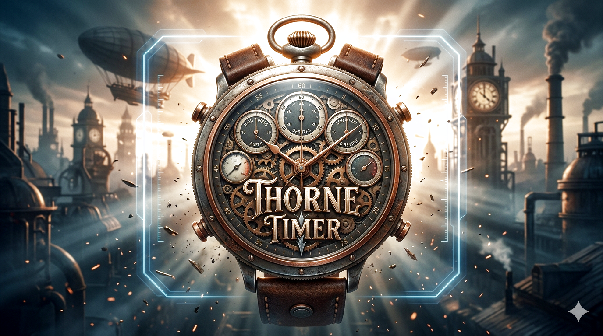

<p align="center">
  
</p>

<h1 align="center">Thorne Timer</h1>

<p align="center">
  <strong>Your EverQuest companion — real-time log parsing, overlay timers, and voice alerts<br/>crafted for the way you play.</strong>
</p>

<p align="center">
  <a href="#features">Features</a> •
  <a href="#screenshots">Screenshots</a> •
  <a href="#getting-started">Getting Started</a> •
  <a href="#how-it-works">How It Works</a> •
  <a href="#roadmap">Roadmap</a> •
  <a href="#version-history">Versions</a> •
  <a href="#building-from-source">Building</a> •
  <a href="#contributing">Contributing</a>
</p>

---

## About

**Thorne Timer** is a desktop companion built for EverQuest players who want to play smarter. It watches your log files in real-time and turns raw game events into overlay timers, voice alerts, and instant notifications — giving you the situational awareness that UI files alone simply cannot provide.

Whether you're tracking buff durations on a raid, timing respawns while multi-boxing, or catching auction messages across characters, Thorne Timer keeps the information you need visible and organized on screen — always on top, always up to date.

Built and tested with the [Project Quarm](https://www.projectquarm.com/) and [TAKP](https://www.takproject.net/) communities, but the log parsing engine works with **any EverQuest server** (or any application) that writes text-based log files.

### Why Thorne Timer?

EverQuest's native UI files can only go so far. While [**Thorne-UI**](https://github.com/draknarethorne/thorne-ui) transforms your in-game interface with enhanced windows, better layouts, and quality-of-life improvements, there are things you simply *cannot* do with XML UI files alone:

- **Always-visible timers** that persist across zone transitions and game restarts
- **Log-triggered automation** that responds to game events in real-time
- **Voice alerts** and customizable text-to-speech notifications
- **Multi-character tracking** across boxing sessions
- **Separate overlay windows** for different timer types so you see what matters

Thorne Timer fills that gap. It lives *outside* the game, quietly reading your logs and surfacing the information that helps you play better — whether that's knowing exactly when your charm will break, catching a tell while alt-tabbed, or tracking four characters' buff timers at a glance.

> 🎯 Built by a player, for players. This is a community project — feedback, ideas, and contributions are always welcome.

---

## Features

### 🎯 Timer Overlays (Mini Views)
Compact, always-on-top windows that float over your game client. Views are now **fully user-configurable** — add as many as you need, choose which timer style each one shows, and pick its own colors.

Thorne Timer ships with a default set of styles you can edit, rename, or extend:

- **Normal** (yellow) — Standard countdown timers for respawns, cooldowns, and custom events
- **Buff** (orange) — Track buff durations so you never let a key buff drop
- **Pet** (lavender) — Dedicated pet-related timers for summoners and beastlords
- **Ping** (light green) — Instant visual notifications for log events (tells, auction alerts, custom triggers)
- **Spawn** (cyan) — Respawn timers and named-mob windows
- **Lockout** (DodgerBlue) — Long-duration raid and instance lockouts
- **Character** (white) — Per-character overlays such as the active character header

Each view remembers its position independently — arrange them once and they stay put. Use the **Styles** and **Views** tabs to add, rename, or delete styles and views, change their colors, and control how empty views display (character name, view name, blank, or hidden).

### ⏱️ Real-Time Log Parsing
Point Thorne Timer at your EQ log file and it starts working immediately:

- **Start keywords** trigger timers when specific text appears in your log
- **End keywords** stop timers early when conditions are met
- **Case-sensitive matching** for precision when you need it
- **Endless mode** for timers that restart automatically

### 🔊 Voice & Sound Alerts
Never miss a timer expiration again:

- **Text-to-speech** — Configure spoken alerts for any timer
- **WAV file playback** — Use custom sound effects
- **Adjustable volume and speech rate** — Tune it to your preference
- **Per-timer audio** — Different sounds for different events

### 📊 Timer Styles (first-class entity)
Each timer has a **Style** that determines its color and which overlay window displays it. Styles are now a **first-class, user-editable entity** with their own tab — add, rename, recolor, or delete them, and any view filtered on that style updates immediately. Use styles to:

- Separate combat timers from buff tracking
- Keep ping notifications in their own corner
- Color-code by raid role, class, or any system you want
- Organize your screen the way you play

### 🗂️ Tome System
Your data lives in a **Tome** (`.tdb` file) — a portable SQLite database that stores everything:

- All your timers, characters, categories, and settings
- Automatically migrated from older versions (EQTimer → ThorneTimer)
- Create multiple tomes for different setups (raiding, soloing, tradeskills)
- Recent tomes menu for quick switching

### 👥 Multi-Character Support
- Maintain separate characters with their own log file paths
- Switch active character on the fly
- Each character's mini view positions are remembered

### 🖥️ Smart Window Management
- **Column width persistence** — resize grid columns once, they're saved to your tome
- **Screen bounds safety** — windows that end up offscreen (monitor changes, etc.) are automatically repositioned to the nearest visible screen
- **Window state persistence** — the app remembers its size, position, and state between sessions

---

## Screenshots

<!-- 
  TODO: Add screenshots showing:
  - Main timer grid with timers configured
  - Mini view overlays floating over the EQ client
  - Timer configuration (Style, keywords, duration)
  - Multiple mini views arranged on screen
-->

*Screenshots coming soon — check back after the next release!*

---

## Getting Started

### Download & Install

1. Download the latest release from the [**Releases**](https://github.com/draknarethorne/thorne-timer/releases) page
2. Extract `ThorneTimer-vX.X.X.zip` to a folder of your choice
3. Run **`ThorneTimer.exe`**

> 🔄 **Upgrading?** Just extract over your existing folder. Your tome will be migrated automatically — all timers, characters, and settings are preserved.

### Requirements
- Windows with .NET Framework 4.8 (included in Windows 10 1903+)
- EverQuest with logging enabled (`/log on` in game)

### Quick Setup
1. **Add a character** — give it a name and browse to your EQ log file (e.g., `eqlog_Draknaré_project1999.txt`)
2. **Select your character** from the dropdown and click **Start Parsing**
3. **Create timers** — set start keywords that match text in your log, set a duration, and optionally add voice/sound alerts
4. **Show Mini Views** — click the mini view button to see your overlay windows
5. **Play!** — timers trigger automatically as events appear in your log

---

## How It Works

```
EverQuest Log File
       │
       ▼
 ┌─────────────┐     ┌──────────────┐     ┌─────────────────┐
 │  Log Parser  │────▶│ Timer Engine │────▶│  Mini View      │
 │ (real-time)  │     │  (matching)  │     │  Overlays       │
 └─────────────┘     └──────────────┘     │  ┌───────────┐  │
                            │              │  │  Normal   │  │
                            ▼              │  │  Buff     │  │
                     ┌──────────────┐     │  │  Pet      │  │
                     │ Voice/Sound  │     │  │  Ping     │  │
                     │   Alerts     │     │  └───────────┘  │
                     └──────────────┘     └─────────────────┘
```

Thorne Timer reads your EQ log file line by line as new entries appear. When a line matches a timer's **start keyword**, the timer begins counting down. When it matches an **end keyword** (or the duration expires), the timer fires its alert. The overlay windows update in real-time — so whether you're watching one character or four, you always know what's happening.

---

## Roadmap

Thorne Timer is evolving into a **complete tactical HUD** for serious multi-boxing, raiding, and everyday EverQuest gameplay:

| Phase | Description |
|-------|-------------|
| **Current (v0.6.0 beta)** | User-editable styles & views, per-view colors, camp-out auto-pause, repository/manager refactor, richer Tome Information with sortable lists |
| **Next (v0.7.0)** | Timer maintenance dialog — separate gameplay view from add/edit/delete, read-only main grid |
| **Planned** | Class-specific timer profiles, zone-aware timers, global (cross-character) timers |
| **Future** | Full spell/ability management per class with smart timer automation |

The goal: the **ultimate timer and notification system** tailored to how *you* play.

For detailed phase breakdowns, see the [Roadmap](Docs/ROADMAP.md).

---

## Version History

**v0.6.0** _beta_

_GUI enhancements, architecture cleanup, and a much richer Tome Information dialog._

**Styles, Views & Categories**
- ✅ **Styles tab** — first-class, user-editable styles with Add/Delete/Rename and color picker
- ✅ **New default styles** — Pet (lavender), Spawn (cyan), Lockout (DodgerBlue), Character (white)
- ✅ **Views tab** — Add/Delete views with dynamic Style filter dropdown, per-view ForeColor / BackColor / ShowWarning / EmptyBehavior
- ✅ **Per-view colors** — each view drives its own mini-view appearance and the main grid row tint
- ✅ **Hybrid Designer + Controller + Repository pattern** for Styles, Views, and Categories tabs

**Character & log handling**
- ✅ **`(None)` character** — manual pause without camping out
- ✅ **Camp-out auto-pause** — detects `/camp` with 10-second inactivity threshold, switches active character to `(None)`
- ✅ **Auto-switch fixes** — suppress the OLD character (not the new one) on manual switch, proper re-enable logic

**Tome Information dialog**
- ✅ **Richer statistics** — total / active / running timer counts, catalog counts (characters, categories, styles, views, classes), and per-category / style / class / scope breakdowns
- ✅ **Tome version stamping** — new `db_meta` table records which app version created and last wrote the tome
- ✅ **Sortable lists** — click any column header on the Feature Usage and breakdown lists to sort; numeric columns sort numerically (10 > 2), text columns alphabetically
- ✅ **Consistent "All" labelling** — unassigned class breakdown rows now read "All" to match the main timer grid's class combo

**Voice & mini views**
- ✅ **Voice system** — all English voices (en-GB, en-AU, en-CA, etc.), comprehensive logging
- ✅ **Mini views hidden from Alt-Tab** via `WS_EX_TOOLWINDOW`

**Architecture & performance**
- ✅ **Per-entity repositories** — Categories, Views, Characters, Classes, Timers, TimerState, and TomeStatistics each own their SQL; `Database.cs` trimmed to connection / schema / settings plumbing
- ✅ **FormMain split into managers** — RecentDatabasesManager, WindowPositionManager, GridLayoutManager, VoiceManager, MiniViewSettingsManager; plus a CharactersController for the Characters tab
- ✅ **Grid performance** — O(n²) → O(n) dictionary lookup in `SyncRuntimeToGrid` (~98% faster with 130+ timers)
- ✅ **One-shot startup migration** — v0.5.0 → v0.6.0 palette migration runs once; deletions stick, no snapback

**Beta 2 fixes**
- ✅ **Performance** — faster character switching and startup; the timers grid now filters via a single data-source swap instead of per-row visibility toggling (~1.8 s → fast on 100+ row grids)
- ✅ **Visual polish** — refreshed default style colors for the black mini-view background; softened inactive-row tint (Gainsboro) so it no longer competes with red style colors
- ✅ **Grid column layout** — fixed Characters/Categories tabs loading with misaligned columns; Styles and Views grids now persist column widths across restarts
- ✅ **Grid correctness** — row colors and curated column order are now preserved after each filter rebuild
- ✅ **Diagnostics** — added `PERF` timing instrumentation around startup and character-switch hot paths
- ✅ **Cleanup** — removed the throwaway layered-window rendering spike from the build

**v0.5.0** (June 2025)

- ✅ Per-character timer state persistence (save/restore across character switches)
- ✅ Auto character switching via log file detection
- ✅ Timer Styles system (Normal, Buff, Pet, Ping) with style-driven mini views
- ✅ Mini view overlays — four always-on-top overlay windows with real-time countdown
- ✅ Compact view mode for the main timer grid
- ✅ Class system with 16 EQ class seed data and class filtering
- ✅ Scope system (World vs Character) replacing legacy categories
- ✅ DependsOn timer chaining (DependsOnTimer + DependsOnDelay)
- ✅ Row painting with style-driven colors across grid and mini views
- ✅ Column width persistence and window state management
- ✅ Parameterized SQL throughout all database operations
- ✅ Comprehensive architecture documentation
- ✅ Multi-column sort with Shift+Click and Ctrl+Click support
- ✅ Group Sort toggle (Class → Style → Name) with previous-sort restore
- ✅ Programmatic toolbar icons for all buttons and menu items
- ✅ Polished About dialog with version, features, runtime info, and GitHub link
- ✅ Help → Tome Info dialog showing database statistics and file information

**v0.1.0 – v0.4.0** (2025) _archived_

- ✅ Core timer engine with start/end keyword matching
- ✅ Real-time EQ log file parsing (LogMonitor)
- ✅ Text-to-speech and WAV audio alerts
- ✅ SQLite database (tome) for timer and settings persistence
- ✅ Always-on-top overlay windows
- ✅ CI/CD pipeline with GitHub Actions (build + release workflows)
- ✅ Code signing support in release workflow
- ✅ Auto-version injection from git tags into AssemblyInfo.cs

---

## Building from Source

### Prerequisites

- **Visual Studio 2019/2022/2025+** with the **.NET desktop development** workload
- **.NET SDK** — for `dotnet restore` ([download](https://dotnet.microsoft.com/download))
- **Git** — for cloning the repo

### Quick Start

```bash
# Clone the repository
git clone https://github.com/draknarethorne/thorne-timer.git
cd thorne-timer

# Restore NuGet packages
dotnet restore "Thorne-Timer.sln"

# Build (from Developer Command Prompt or with MSBuild on PATH)
msbuild "Thorne-Timer.sln" /t:Rebuild /p:Configuration=Debug /p:Platform="Any CPU"
```

### Visual Studio Setup

1. Open `Thorne-Timer.sln` in Visual Studio
2. Go to **Build → Configuration Manager** and ensure Platform is set to `Any CPU`
3. Right-click **ThorneTimer** in Solution Explorer → **Set as Startup Project**
4. Press **F5** to build and run

### Development Tools

This project uses **two IDEs** for different purposes — each chosen for what it does best:

| Tool | When to Use | What It's Best At |
|------|-------------|-------------------|
| **Visual Studio** | Active development, debugging, building | IntelliSense for C#/.NET, WinForms designer, NuGet management, breakpoint debugging, profiling |
| **VS Code** | Documentation, code review, git workflow, AI-assisted analysis | Markdown editing, Copilot agents, multi-file search, lightweight browsing, PR reviews |

**Visual Studio** is the primary IDE for writing C# code, designing WinForms, and debugging the application. Open `Thorne-Timer.sln` for full project support.

**VS Code** is the companion workspace for documentation, architecture analysis, and AI-powered code review via GitHub Copilot agents. Open `thorne-timer.code-workspace` for the configured workspace with recommended extensions and settings.

> 💡 **Tip:** Both can be open simultaneously — Visual Studio for building and debugging, VS Code for documentation edits, Copilot chat, and git operations.

---

## Troubleshooting

| Issue | Solution |
|-------|----------|
| `BaseOutputPath/OutputPath property is not set` | Ensure Platform is `Any CPU` (with space) in Configuration Manager. Run `dotnet restore`. |
| Missing NuGet/targets errors | Run `dotnet restore "Thorne-Timer.sln"` |
| Old icon showing in Windows | Clear Windows icon cache: delete files in `%localappdata%\Microsoft\Windows\Explorer\iconcache*` and restart Explorer |

---

## Contributing

Thorne Timer is a community project — built to help fellow EverQuest players get more out of the game they love. Contributions, ideas, and feedback are all welcome!

- 🐛 **Found a bug?** [Open an issue](https://github.com/draknarethorne/thorne-timer/issues)
- 💡 **Have an idea?** Start a discussion or submit a feature request
- 🛠️ **Want to contribute?** Fork the repo and submit a pull request

---

## CI/CD

This project uses GitHub Actions for continuous integration and release automation.

| Workflow | Trigger | Purpose |
|----------|---------|---------|
| **Build** | Push to `main`/`working-on-views`, PRs | Compiles Debug & Release, uploads artifacts |
| **Release** | Push `v*` tags | Builds, packages, creates GitHub Release with auto-generated changelog |

### Creating a Release

```bash
# Merge your work to main
git checkout main
git merge miniview-enhancements

# Tag a new version
git tag -a v0.5.0 -m "Release v0.5.0: Per-character state, auto-switch, timer styles"
git push origin main --tags
```

The release workflow will automatically:
1. **Extract version from tag** (`v0.5.0` → `0.5.0.0`)
2. **Inject into AssemblyInfo.cs** — the built EXE has the correct version embedded
3. Build the Release configuration
4. **Sign the executable** (if signing certificate is configured)
5. Package all required files into a ZIP
6. Create a GitHub Release with download links and **auto-generated changelog** from commits since the previous tag

**Versioning:** Use semantic versioning (e.g., `v0.5.0`, `v1.0.0`, `v2.0.0-beta`). Pre-release tags containing `-` are automatically marked as pre-release.

> 💡 **Note:** You don't need to manually update `AssemblyInfo.cs` before releases — the workflow handles it automatically!

For the complete release process, see [Docs/releases/PUBLISHING.md](Docs/releases/PUBLISHING.md). For version management details, see [Docs/VERSION-MANAGEMENT.md](Docs/VERSION-MANAGEMENT.md).

---

## License

This project is licensed under the **MIT License** — see the [LICENSE](LICENSE) file for details.

Free to use, modify, and share. Built for the EverQuest community, useful anywhere there are log files to parse.

---

<p align="center">
  <sub>Built with ☕ for the Project Quarm community by Draknaré Thorne</sub><br/>
  <sub>⚔️ See you in Norrath</sub>
</p>
